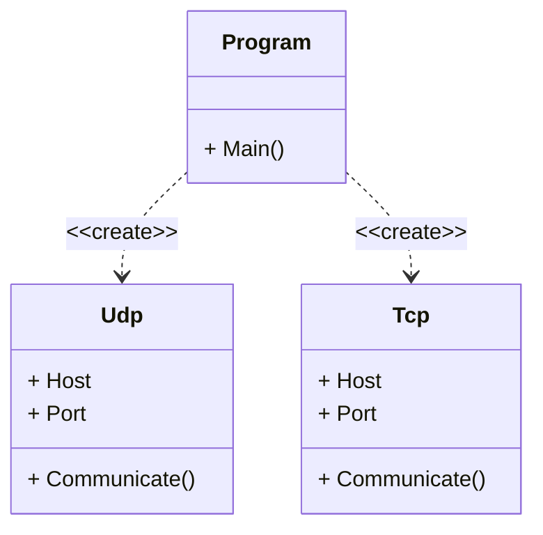

# IPK Projekt 1
Cie¾om projektu je vytvori� klienta ku vzdialenej kalkulaèke, ktorı bude komunikova� pomocou protokolu IPK Calculator Protocol. Program je napísanı v objekoto orientovanom jazyku C#.

## Štruktúra projektu
Z h¾adiska štruktúry je projekt rozdelenı do troch tried a to `Program`, `Udp` a `Tcp`. `Program` je základná trieda, ktorá obsahuje metódu `Main()`, ktorá je vstupnım bodom programu. Triedy `Udp` a `Tcp` poskytujú metódy pre komunikáciu pomocou UDP/TCP protokolu. 

## UML Diagram

## Teória
V nasledujúcej èasti struène zhrniem teóriu nutnú k pochopeniu implementovanej funkcionality. Zameriam sa hlavne na dva protokoly transportnej vrstvy a to UDP a TCP. Vychádza� budem zo zdrojov [1] a [2].

### UDP
Protokol UDP, definovanı v [RFC 768], poskytuje nespojovú transportnú slu�bu. Prenos dát pomocou takéhoto spojenia je nespo¾ahlivı a niè negarantuje. Postup pri komunikácii pomocou tohto protokolu zo strany klienta pozostáva z nasledujúcich fáz:
1. Vytvorenie socketu
2. Odoslanie dát na server
3. Èakanie na odpoveï
4. Ukonèenie komunikácie

### TCP
Protokol TCP je spojovo orientovaná transportná slu�ba. Pred zaèatím komunikácie musí prebehnú� medzi serverom a klientom tzv. "handshake" - to znamená, �e si musia navzájom posla� úvodné správy, ktoré nastavia parametre komunikácie. Protokol TCP je spo¾ahlivı a pri neúspechu doruèenia správy, opakovane posiela dáta znovu. Pri TCP je postup pri komunikácii na strane klienta nasledovnı:
1. Vytvorenie socketu
2. Ustanovenie spojenia
3. Odoslanie dát na server
4. Èakanie na odpoveï
5. Ukonèenie komunikácie

## Testovanie
Testovanie bolo uskutoènené automatizovanımi skriptami `test_cli.py`, `test_udp.py` a `test_tcp.py`. Aplikácia bola testovaná v poskytnutom virtuálnom stroji s operaènım systémom Linux (distribúcia NixOS 22.11 Raccoon). Poèas testovania aplikácia komunikovala s refernènım serverom, ktorı bol spustenı nasledovnım príkazom: `ipkpd -h 127.0.0.1 -p 2023 -m (udp|tcp)`. Testy boli spúš�ané na zariadení Dell Latitude 5491 (Intel Core i7, 8GB RAM DDR4, 256GB SSD). Testovaná aplikácia bola vo verzii 1.0.0.

- `test_cli.py` testuje správne spracovanie argumentov príkazového riadku
- `test_udp.py` testuje komunikáciu pomocou protokolu UDP
- `test_tcp.py` testuje komunikáciu pomocou protokolu TCP

Vystup z testovania:
```
[nix-shell:~/IPK-Projekt-1/src/bin/Debug/net6.0]$ python test_cli.py 
Testing Command-line interface
 Passed ./ipkcpc -h 127.0.0.1 -p 2023 -m udp -x
 Passed ./ipkcpc -p 2023 -m tcp
 Passed ./ipkcpc -h 127.0.0.1 -p 2023 -m sctp
 Passed ./ipkcpc -h 127.0.0.1 -p eighty -m udp
 Passed ./ipkcpc -h google.com -p 2023 -m tcp
 Passed ./ipkcpc
 Passed ./ipkcpc --help

[nix-shell:~/IPK-Projekt-1/src/bin/Debug/net6.0]$ python test_udp.py 
Testing UDP
 Passed (+ 1 2)
 Passed (a b)
 Passed (/ 0 -1) (- -50 60)
 Passed (* 12 12) (/ 10 0) (- c d) (/ 23 11)
 Passed Empty input

[nix-shell:~/IPK-Projekt-1/src/bin/Debug/net6.0]$ python test_tcp.py 
Testing TCP
 Passed HELLO SOLVE (+ 1 2) BYE
 Passed HELLO SOLVE (- 0 -1) SOLVE (/ 42 2) BYE
 Passed HELLO BYE
 Passed Hi
 Passed Empty input
```

## Bibliografia
[1] KUROSE James F. a Keith W. ROSS. <em>Computer networking: a top-down approach</em>. Eighth edition.; Global edition. Harlow: Pearson Education Limited, 2022, ISBN 978-1-292-40546-9.<br/>
[2] DOLEJŠKA Daniel a KOUTENSKİ Michal <em>Programování sí�ovıch aplikací</em>. VUT FIT: NES@FIT, 2023